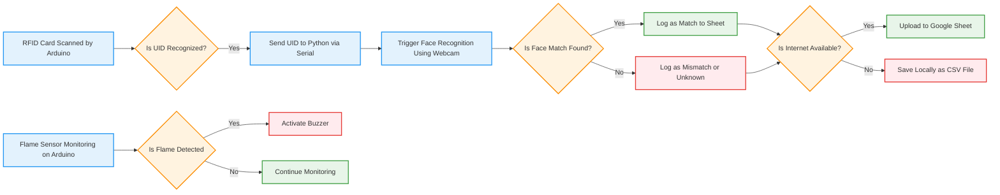

# smart-attendance-system
A hybrid RFID and face recognition-based attendance system with real-time fire detection alerts, integrating Arduino sensors and Python automation.

```mermaid 
graph LR
    A[RFID Card Scanned by Arduino] --> B{Is UID Recognized?}
    B -- Yes --> C[Send UID to Python via Serial]
    C --> D[Trigger Face Recognition Using Webcam]
    D --> E{Is Face Match Found?}
    E -- Yes --> F[Log as Match to Sheet]
    E -- No --> G[Log as Mismatch or Unknown]

    F --> H{Is Internet Available?}
    G --> H

    H -- Yes --> I[Upload to Google Sheet]
    H -- No --> J[Save Locally as CSV File]

    K[Flame Sensor Monitoring on Arduino] --> L{Is Flame Detected}
    L -- Yes --> M[Activate Buzzer]
    L -- No --> N[Continue Monitoring]

    %% Styling
    classDef input fill:#e3f2fd,stroke:#2196f3,stroke-width:2px;
    classDef decision fill:#fff3e0,stroke:#fb8c00,stroke-width:2px;
    classDef success fill:#e8f5e9,stroke:#43a047,stroke-width:2px;
    classDef danger fill:#ffebee,stroke:#e53935,stroke-width:2px;

    class A,C,D,K input;
    class B,E,H,L decision;
    class F,I,N success;
    class G,J,M danger;

```
